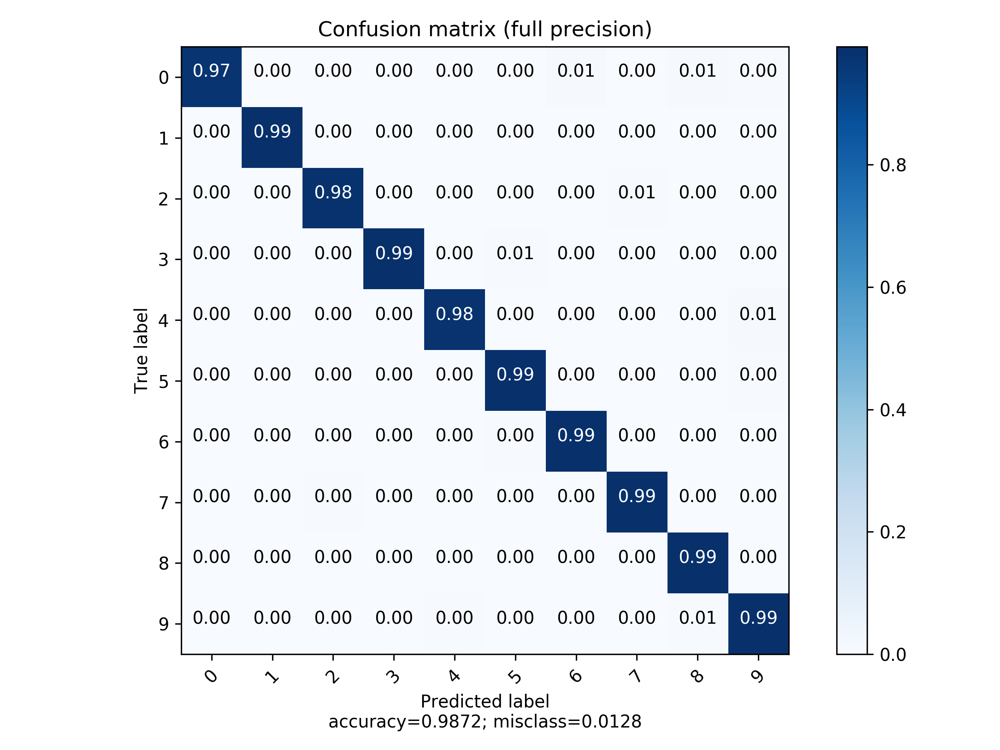
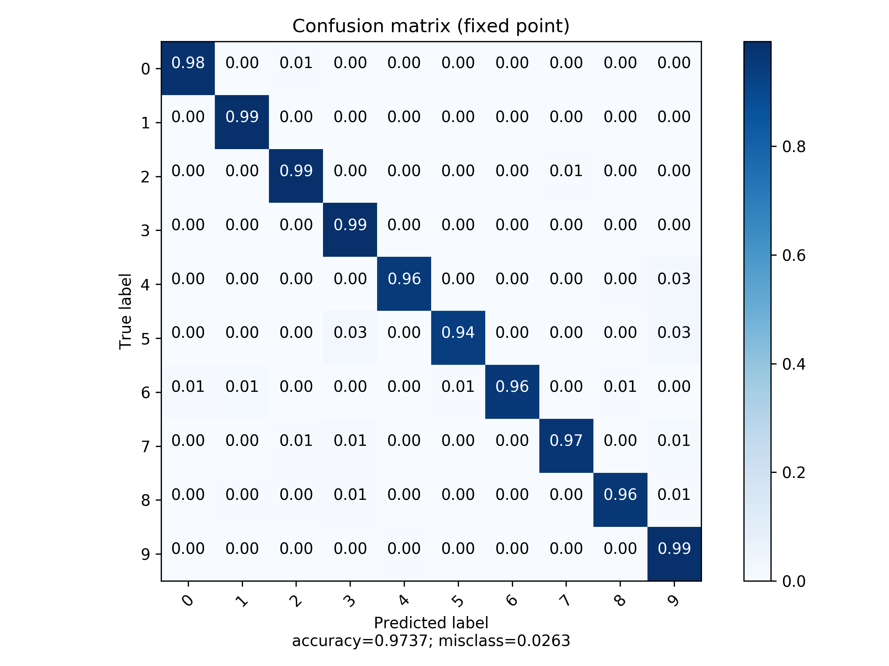

# Neural Network Training

The training can be done with either Pytorch or Keras, but Pytorch is recommended because of the unreliable
API of Tensorflow (the foundation of Keras)


## Build and Requirements

Make sure you install all requirements:

````shell script
pip install -r requirements.txt
````

Additionally for verification (we don't trust Tensorflow/Keras/Pytorch blindly) the Neural Network Extension package 
must be installed. The source code is in the `python` folder (from the repository root). There are also 
precompiled python wheels on Github available.

To train the network simply run in a terminal:

```shell script

python train_torch.py
python quantize.py

```

or use the Jupyter notebook to train the network.

## Results

For quantisation fixed point quantisation has been used.

| Network              | Accuracy |
|----------------------|---------:|
| Network:             | 0.9832   |
| FPI Network (8/4):   | 0.9349   |




